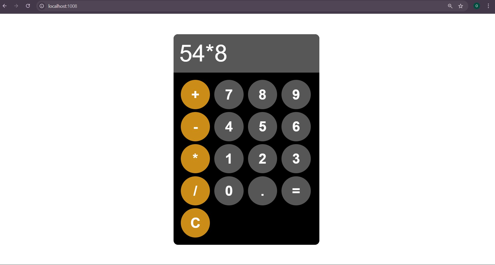

# 🧮 Dockerized Calculator Application

A simple web-based calculator application built using **HTML, CSS, and JavaScript**, containerized using **Docker**, and deployed using **Docker port mapping**.

This project is created to demonstrate basic Docker concepts such as image creation, container execution, and port mapping.

---

## 🚀 Features

- Simple and clean calculator UI
- Supports basic arithmetic operations (+, -, *, /)
- Fully containerized using Docker
- Accessible via browser using port mapping
- Lightweight and beginner-friendly project

---

## 🐳 Docker Implementation
The Dockerfile uses Nginx to serve the static calculator files.

---

## How to run the project

1. **Clone the Repository**
   ```powershell
   git clone https://github.com/<your-username>/dockerized-calculator-app.git
   cd dockerized-calculator-app
   ```
2. Build the Docker Image
   ```powershell
   docker build -t calc-img .

   ```
3. Run the Docker Container
   ```powershell
   docker run -d --name calc-cont -p 8080:80 calc-img
   ```
4. Access the Application
   Open your browser and visit:
   ```powershell
   http://localhost:8080

   ```

## 📸 Screenshots
## Calculator UI


## 📚 Learning Outcomes
- Understanding Docker images and containers
- Using Docker port mapping
- Deploying a static web application using Nginx
- Structuring a simple DevOps project for GitHub

## 👨‍💻 Author
Omkar Nerale (Cloud and DevOps Engineer)

